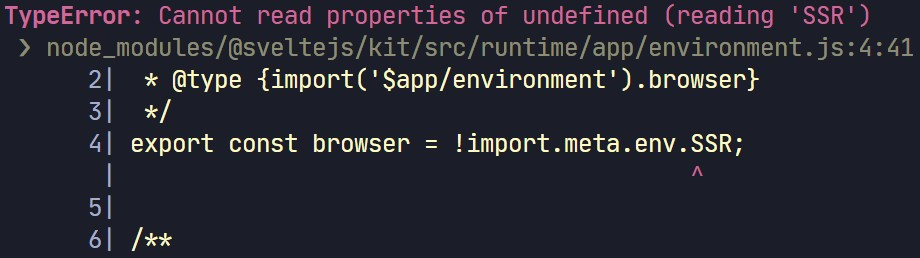

# Svelte Component Test Recipes

Svelte component test recipes using Vitest & Testing Library with TypeScript

In this repo, we'll use `vitest`, `@testing-library/svelte`, and `svelte-htm` to test Svelte components that seemed to be hard to test. Such as **two-way bindings**, **name slots**, **Context API**, ...etc.

As a Svelte advocate, the fantastic DX is one of the reasons I love Svelte. While component testing is something that I think we can still improve over time.

Feel free to open an issue or send a PR to add more test recipes. 😉

Blog post @hashnode: https://davipon.hashnode.dev/svelte-component-test-recipes

---

## Table of Contents

- [Svelte Component Test Recipes](#svelte-component-test-recipes)
  - [Table of Contents](#table-of-contents)
  - [Setup](#setup)
    - [`vite.config.ts`](#viteconfigts)
    - [`setupTest.ts`](#setuptestts)
  - [Testing component props](#testing-component-props)
    - [Get your component props type](#get-your-component-props-type)
  - [Testing component events](#testing-component-events)
    - [Pure `vitest` events testing](#pure-vitest-events-testing)
  - [Testing the `bind:` directive (two-way binding)](#testing-the-bind-directive-two-way-binding)
  - [Testing the `use:` directive (Svelte Actions)](#testing-the-use-directive-svelte-actions)
  - [Testing slots](#testing-slots)
    - [Slot fallbacks](#slot-fallbacks)
    - [Named slots](#named-slots)
    - [Optional slots ($$slot)](#optional-slots-slot)
    - [Slot props](#slot-props)
  - [Testing the Context API](#testing-the-context-api)
  - [Testing components that use SvelteKit runtime modules (`$app/*`)](#testing-components-that-use-sveltekit-runtime-modules-app)
  - [Testing data fetching components using `msw`](#testing-data-fetching-components-using-msw)
    - [Setup `msw`](#setup-msw)
    - [Mock REST API](#mock-rest-api)
  - [Credits](#credits)
  - [Resources](#resources)

## Setup

Let's install libraries in your SvelteKit project.

```bash
# Minimal setup
npm install -D vitest c8 @testing-library/svelte jsdom
# Companion libraries for Testing Library
npm install -D @testing-library/jest-dom  @testing-library/dom @testing-library/user-event @types/testing-library__jest-dom
# Test harness libraries
npm install -D svelte-htm svelte-fragment-component patch-package

```

### `vite.config.ts`

`Vitest` can read your root `vite.config.(js|ts)` to match with the plugins and setup as your Vite app (SvelteKit), and here is my setup:

```ts
// vite.config.ts
import { sveltekit } from '@sveltejs/kit/vite';
import type { UserConfig } from 'vite';
import { configDefaults, type UserConfig as VitestConfig } from 'vitest/config';

const config: UserConfig & { test: VitestConfig['test'] } = {
  plugins: [sveltekit()],
  define: {
    // Eliminate in-source test code
    'import.meta.vitest': 'undefined'
  },
  test: {
    // jest like globals
    globals: true,
    environment: 'jsdom',
    // in-source testing
    includeSource: ['src/**/*.{js,ts,svelte}'],
    // Add @testing-library/jest-dom matchers & mocks of SvelteKit modules
    setupFiles: ['./setupTest.ts'],
    // Exclude files in c8
    coverage: {
      exclude: ['setupTest.ts']
    },
    deps: {
      // Put Svelte component here, e.g., inline: [/svelte-multiselect/, /msw/]
      inline: []
    },
    // Exclude playwright tests folder
    exclude: [...configDefaults.exclude, 'tests']
  }
};

export default config;
```

### `setupTest.ts`

You may notice that there is a `setupTest.ts` file. We can add `@testing-library/jest-dom` matchers & mocks of SvelteKit there:

```ts
// setupTest.ts
/* eslint-disable @typescript-eslint/no-empty-function */
import matchers from '@testing-library/jest-dom/matchers';
import { expect, vi } from 'vitest';
import type { Navigation, Page } from '@sveltejs/kit';
import { readable } from 'svelte/store';
import * as environment from '$app/environment';
import * as navigation from '$app/navigation';
import * as stores from '$app/stores';

// Add custom jest matchers
expect.extend(matchers);

// Mock SvelteKit runtime module $app/environment
vi.mock('$app/environment', (): typeof environment => ({
  browser: false,
  dev: true,
  building: false,
  version: 'any',
}));

// Mock SvelteKit runtime module $app/navigation
vi.mock('$app/navigation', (): typeof navigation => ({
  afterNavigate: () => {},
  beforeNavigate: () => {},
  disableScrollHandling: () => {},
  goto: () => Promise.resolve(),
  invalidate: () => Promise.resolve(),
  invalidateAll: () => Promise.resolve(),
  preloadData: () => Promise.resolve(),
  preloadCode: () => Promise.resolve()
}));

// Mock SvelteKit runtime module $app/stores
vi.mock('$app/stores', (): typeof stores => {
  const getStores: typeof stores.getStores = () => {
    const navigating = readable<Navigation | null>(null);
    const page = readable<Page>({
      url: new URL('http://localhost'),
      params: {},
      route: {
        id: null
      },
      status: 200,
      error: null,
      data: {},
      form: undefined
    });
    const updated = { subscribe: readable(false).subscribe, check: () => false };

    return { navigating, page, updated };
  };

  const page: typeof stores.page = {
    subscribe(fn) {
      return getStores().page.subscribe(fn);
    }
  };
  const navigating: typeof stores.navigating = {
    subscribe(fn) {
      return getStores().navigating.subscribe(fn);
    }
  };
  const updated: typeof stores.updated = {
    subscribe(fn) {
      return getStores().updated.subscribe(fn);
    },
    check: () => false
  };

  return {
    getStores,
    navigating,
    page,
    updated
  };
});

```

> The `@testing-library/jest-dom` library provides a set of custom jest matchers that you can use to extend vitest. These will make your tests more declarative and clear to read and maintain. You can also check [Common mistakes with React Testing Library #Using the wrong-assertion](https://kentcdodds.com/blog/common-mistakes-with-react-testing-library#using-the-wrong-assertion).

> SvelteKit runtime modules like `$app/stores` and `$app/navigation` are not set until SvelteKit's start function is called, which means you won't have them in a test environment because tests are isolated.
>
> This error occurs if we test the component which uses `$app` modules without mocking them:
> 
>
>In the context of unit testing, any small gaps in functionality can be resolved by simply mocking that module.

OK! The setup is ready. Let's start with a simple component test.

## Testing component props

Here's our svelte component:

`$lib/props/DefaultProps.svelte`

```svelte
<script>
  export let answer = 'a mystery';
</script>

<p>The answer is {answer}</p>
```

It's a simple component with only one prop `answer` with a default value.

Let's see how to test the default value and pass a new one:

```ts
// $lib/props/DefaultProps.test.ts
import { render, screen } from '@testing-library/svelte';
import DefaultProps from './DefaultProps.svelte';

it("doesn't pass prop", () => {
  render(DefaultProps);
  expect(screen.queryByText('The answer is a mystery')).toBeInTheDocument();
});

it('set and update prop', async () => {
  // Pass your prop to the render function
  const { component } = render(DefaultProps, { answer: 'I dunno' });

  expect(screen.queryByText('The answer is I dunno')).toBeInTheDocument();

  // Update prop using Svelte's Client-side component API
  await component.$set({ answer: 'another mystery' });
  expect(screen.queryByText('The answer is another mystery')).toBeInTheDocument();
});
```

### Get your component props type

If you're using TypeScript, a recent release of `@testing-library/svelte`
had improved props typing for `render` function:


Sometimes you may want to predefine your props before passing. We can use Svelte's native utility type `ComponentProps`. `ComponentProps` takes in a Svelte component type and gives you a type corresponding to the component’s props.

```ts
// $lib/props/DefaultProps.test.ts
import type { ComponentProps } from 'svelte';
import { render, screen } from '@testing-library/svelte';
import DefaultProps from './DefaultProps.svelte';

it('Pass predefined prop to the component', () => {
  const prop: ComponentProps<DefaultProps> = { answer: 'TypeScript!' };

  render(DefaultProps, prop);

  expect(screen.getByText('The answer is TypeScript!'));
});
```

> I highly recommend reading this excellent post from Andrew Lester: [Typing Components in Svelte](https://www.viget.com/articles/typing-components-in-svelte/).

## Testing component events

The component we're going to test has a button that'll dispatch a custom event `message` when you click on it. It's the component from [svelte.dev/tutorials/component-events](https://svelte.dev/tutorial/component-events).

`$lib/events/ComponentEvent.svelte`

```svelte
<script>
  import { createEventDispatcher } from 'svelte';

  const dispatch = createEventDispatcher();

  function sayHello() {
    dispatch('message', {
      text: 'Hello!'
    });
  }
</script>

<button on:click={sayHello}> Click to say hello </button>
```

To test component events, we use a combination of vitest utility function [`vi.fn`](https://vitest.dev/api/#vi-fn) and the Svelte client-side component API [`component.$on`](https://svelte.dev/docs#run-time-client-side-component-api-$on). We also use [`@testing-library/user-event`](https://github.com/testing-library/user-event) instead of the built-in `fireEvent` to simulate user interactions.

> `user-event` applies workarounds and mocks the UI layer to simulate user interactions like they would happen in the browser. Check [Common mistakes with React Testing Library  #Not using @testing-library/user-event](https://kentcdodds.com/blog/common-mistakes-with-react-testing-library#not-using-testing-libraryuser-event).

```ts
// $lib/events/ComponentEvent.test.ts
import { render, screen } from '@testing-library/svelte';
import ComponentEvent from './ComponentEvent.svelte';
import userEvent from '@testing-library/user-event';

it('Test ComponentEvent component', async () => {
  const user = userEvent.setup();

  const { component } = render(ComponentEvent);

  // Mock function
  let text = '';
  const mock = vi.fn((event) => (text = event.detail.text));
  component.$on('message', mock);

  const button = screen.getByRole('button');
  await user.click(button);

  expect(mock).toHaveBeenCalled();
  expect(text).toBe('Hello!');
});
```

We first create a mock function and pass it to the `component.$on`, so we can monitor it whenever the component dispatch a `message` event.

### Pure `vitest` events testing

You can also test component events without `@testing-library` using only `vitest`:

```ts
import Component from '$lib/MyComponent.svelte'
import { expect, test, vi } from 'vitest'

test(`invokes callback functions`, async () => {
  const keyup = vi.fn()
  const click = vi.fn()

  const instance = new Component({
    target: document.body,
    props: { foo: `bar` },
  })

  instance.$on(`keyup`, keyup)
  instance.$on(`click`, click)

  const node = document.querySelector(`.some-css-selector`)

  if (!node) throw new Error(`DOM node not found`)

  node.dispatchEvent(new KeyboardEvent(`keyup`, { key: `Enter` }))
  expect(keyup).toHaveBeenCalledTimes(1)

  node.dispatchEvent(new MouseEvent(`click`))
  expect(click).toHaveBeenCalledTimes(1)
})
```

## Testing the `bind:` directive (two-way binding)

We use `Keypad.svelte` from [svelte.dev/tutorial/component-bindings](https://svelte.dev/tutorial/component-bindings):

`$lib/bindings/Keypad.svelte`

```svelte
<script lang="ts">
  import { createEventDispatcher } from 'svelte';

  export let value = '';

  const dispatch = createEventDispatcher();

  const select = (num: number) => () => (value += num);
  const clear = () => (value = '');
  const submit = () => dispatch('submit');
</script>

<div class="keypad">
  <button on:click={select(1)}>1</button>
  <button on:click={select(2)}>2</button>
  <button on:click={select(3)}>3</button>
  <button on:click={select(4)}>4</button>
  <button on:click={select(5)}>5</button>
  <button on:click={select(6)}>6</button>
  <button on:click={select(7)}>7</button>
  <button on:click={select(8)}>8</button>
  <button on:click={select(9)}>9</button>

  <button disabled={!value} on:click={clear}>clear</button>
  <button on:click={select(0)}>0</button>
  <button disabled={!value} on:click={submit}>submit</button>
</div>

<style>
  .keypad {
    display: grid;
    grid-template-columns: repeat(3, 5em);
    grid-template-rows: repeat(4, 3em);
    grid-gap: 0.5em;
  }

  button {
    margin: 0;
  }
</style>
```

There is no programmatic interface to test `bind:`, `use:`, slots, and Context API. Instead of creating a dummy svelte component (e.g. `TestHarness.svelte`) to test your component, we can use [`svelte-htm`](https://github.com/kenoxa/svelte-htm) to simplify your testing code.

Assume we use `Keypad.svelte` in one of the `+page.svelte`:

```svelte
<Keypad bind:value={} on:submit={} />
```

To test the two-way binding of `value`, we use a writeable store as property value:

```ts
// $lib/bindings/Keypad.test.ts
import { get, writable } from 'svelte/store';
import { render, screen } from '@testing-library/svelte';
import html from 'svelte-htm';
import Keypad from './Keypad.svelte';
import userEvent from '@testing-library/user-event';

describe('Test Keypad component', async () => {
  const user = userEvent.setup();

  it('Test two-way binding', async () => {
    // Create a writable store to enable reactivity
    const pin = writable('');
    const mock = vi.fn();

    render(html`<${Keypad} bind:value=${pin} on:submit=${mock} />`);

    // Get Keypad button "1"
    const button1 = screen.getByText('1');
    await user.click(button1);
    await user.click(button1);
    expect(get(pin)).toBe('11');

    const submitButton = screen.getByText('submit');
    await user.click(submitButton);
    expect(mock).toHaveBeenCalled();

    const clearButton = screen.getByText('clear');
    await user.click(clearButton);
    expect(get(pin)).toBe('');
  });
});

```

## Testing the `use:` directive (Svelte Actions)

We use the example from [svelte.dev/tutorial/actions](https://svelte.dev/tutorial/actions):

```ts
// $lib/actions/clickOutside.ts
export function clickOutside(node: HTMLElement) {
  const handleClick = (event: Event) => {
    if (!node.contains(event.target as Node)) {
      node.dispatchEvent(new CustomEvent('outclick'));
    }
  };

  document.addEventListener('click', handleClick, true);

  return {
    destroy() {
      document.removeEventListener('click', handleClick, true);
    }
  };
}
```

Then use it in `src/routes/actions/+page.svelte`:

```svelte
<script lang="ts">
  import { clickOutside } from '$lib/actions/clickOutside';

  let showModal = true;
</script>

<button on:click={() => (showModal = true)}>Show Modal</button>
{#if showModal}
  <div class="box" use:clickOutside on:outclick={() => (showModal = false)}>Click outside me!</div>
{/if}
```

To test svelte actions, we test the function but not the component which uses the function. Be careful that we need to use `use:action=${/** yourActionFunction *}` in `svelte-htm`'s tagged templates:

```ts
import { render, screen } from '@testing-library/svelte';
import html from 'svelte-htm';
import userEvent from '@testing-library/user-event';
import { clickOutside } from './clickOutside';

it('Test clickOutside svelte action', async () => {
  const user = userEvent.setup();
  const mock = vi.fn();

  render(html`
    <button>Outside the button</button>
    <button
      use:action=${clickOutside /** or (node) => yourAction(node, params) */}
      on:outclick=${mock}
    >
      Click outside me!
    </button>
  `);

  const button = screen.getByText('Outside the button');
  await user.click(button);
  expect(mock).toHaveBeenCalled();
});
```

## Testing slots

We have four examples from [svelte.dev/slots](https://svelte.dev/tutorial/slot-fallbacks):

- Slot fallbacks
- Named slots
- Optional slots
- Slot props

### Slot fallbacks

`$lib/slot-fallbacks/Box.svelte`

```svelte
<div class="box">
  <slot>
    <em>no content was provided</em>
  </slot>
</div>
```

It's easy to test using `svelte-htm`:

```ts
// $lib/slot-fallbacks/Box.test.ts
import { render, screen } from '@testing-library/svelte';
import html from 'svelte-htm';
import Box from './Box.svelte';

describe('Test slot fallbacks', () => {
  it('Put some elements', () => {
    render(html`<${Box}><h2>Hello!</h2></${Box}>`);
    expect(screen.getByText('Hello!')).toBeInTheDocument();
  });

  it('Test slot fallback', () => {
    render(html`<${Box} />`);
    expect(screen.getByText('no content was provided')).toBeInTheDocument();
  });
});
```

### Named slots

`$lib/named-slots/ContactCard.svelte`

```svelte
<article class="contact-card">
  <h2>
    <slot name="name">
      <span class="missing">Unknown name</span>
    </slot>
  </h2>

  <div class="address">
    <slot name="address">
      <span class="missing">Unknown address</span>
    </slot>
  </div>

  <div class="email">
    <slot name="email">
      <span class="missing">Unknown email</span>
    </slot>
  </div>
</article>
```

```ts
// $lib/named-slots/ContactCard.test.ts
import { render, screen } from '@testing-library/svelte';
import html from 'svelte-htm';
import ContactCard from './ContactCard.svelte';

describe('Test name slots', () => {
  it('Only put slot "name"', () => {
    render(html`
      <${ContactCard}>
        <span slot="name"> P. Sherman </span>
      </${ContactCard}>
    `);

    // Fallbacks
    expect(screen.getByText('Unknown address')).toBeInTheDocument();
    expect(screen.getByText('Unknown email')).toBeInTheDocument();
  });
});
```

### Optional slots ($$slot)

> Check the implementation here: [svelte.dev/tutorial/optional-slots](https://svelte.dev/tutorial/optional-slots) or `src/lib/optional-slots/*`

There are two components, and both accept slots:

- `Comment.svelte`: Accepts any content in the slot
- `Project.svelte`: Check if named slot `comments` exists

`$lib/optional-slots/Project.svelte`

```svelte
<script lang="ts">
  export let title: string;
  export let tasksCompleted = 0;
  export let totalTasks = 0;
</script>

<article class:has-discussion={$$slots.comments}>
  <div>
    <h2>{title}</h2>
    <p>{tasksCompleted}/{totalTasks} tasks completed</p>
  </div>
  {#if $$slots.comments}
    <div class="discussion">
      <h3>Comments</h3>
      <slot name="comments" />
    </div>
  {/if}
</article>
```

We can test the optional slot by checking the class name `has-discussion`:

```ts
import { render, screen } from '@testing-library/svelte';
import html from 'svelte-htm';
import Project from './Project.svelte';
import Comment from './Comment.svelte';

describe('Test optional slots', () => {
  it('Put Comment component in Project', () => {
  render(html`
    <${Project} title="Add TypeScript support" tasksCompleted="{25}" totalTasks="{57}">
      <div slot="comments">
        <${Comment} name="Ecma Script" postedAt=${new Date('2020-08-17T14:12:23')}>
          <p>Those interface tests are now passing.</p>
        </${Comment}>
      </div>
    </${Project}>
  `);

  const article = screen.getAllByRole('article')[0];

  expect(article).toHaveClass('has-discussion');
  });

  it('No slot in Project component', () => {
  render(html`
    <${Project} title="Update documentation" tasksCompleted="{18}" totalTasks="{21}" />
  `);

  const article = screen.getAllByRole('article')[0];

  expect(article).not.toHaveClass('has-discussion');
  expect(screen.queryByText('Comments')).not.toBeInTheDocument();
  });
});

```

### Slot props

`$lib/slot-props/Hoverable.svelte`

```svelte
<script lang="ts">
  let hovering: boolean;

  function enter() {
    hovering = true;
  }

  function leave() {
    hovering = false;
  }
</script>

<div on:mouseenter={enter} on:mouseleave={leave}>
  <slot {hovering} />
</div>
```

To test the slot prop, we can create a writable store and subscribe to the `let:hovering`, and use `user.hover` to simulate hovering, which is not viable using the native `fireEvent`:

```ts
import { get, writable } from 'svelte/store';
import { render, screen } from '@testing-library/svelte';
import html from 'svelte-htm';
import Hoverable from './Hoverable.svelte';
import userEvent from '@testing-library/user-event';

it('Test slot props', async () => {
  const user = userEvent.setup();
  const hovering = writable(false);

  render(html`
    <${Hoverable} let:hovering=${hovering}>
      <div data-testid="hover" class:active=${hovering}>
          <p>Hover over me!</p>
      </div>
    </${Hoverable}>
  `);

  const element = screen.getByText('Hover over me!');
  await user.hover(element);

  expect(get(hovering)).toBeTruthy();
  expect(screen.getByTestId('hover')).toHaveClass('active');
});
```

## Testing the Context API

Here is the component that uses `getContext`:

`$lib/contexts/ContextComponent.svelte`

```svelte
<script>
  import { getContext } from 'svelte';

  const userDetails = getContext('user-details');
</script>

<div>
  <div>
    <strong>User Name:</strong>
    {userDetails.username}
  </div>

  <div>
    <strong>User Login Status:</strong>
    {userDetails.islogin}
  </div>
</div>
```

We can create a parent component that does `setContext` to test the Context API. We use [`svelte-fragment-component`](https://github.com/kenoxa/svelte-fragment-component#readme), which provides some useful component lifecycle properties and a context property. In combination with `svelte-htm` the example could be written as:

```ts
// $lib/contexts/ContextComponent.test.ts
import { render, screen } from '@testing-library/svelte';
import html from 'svelte-htm';
import Fragment from 'svelte-fragment-component';
import ContextComponent from './ContextComponent.svelte';

it('Test Context API', () => {
  const userDetails = { username: 'abc@example.com', islogin: 'yes' };

  render(html`
    <${Fragment} context=${{ 'user-details': userDetails }}>
      <${ContextComponent}/>
    </$>
  `);

  expect(screen.getByText('abc@example.com')).toBeInTheDocument();
  expect(screen.getByText('yes')).toBeInTheDocument();
});

```

## Testing components that use SvelteKit runtime modules (`$app/*`)

Sometimes your component needs to interact with SvelteKit modules like `$app/stores` or `$app/navigation`:

```svelte
<script lang="ts">
  import { page } from '$app/stores';
  import logo from './svelte-logo.svg';
</script>

<header>
  <nav>
    <svg viewBox="0 0 2 3" aria-hidden="true">
      <path d="M0,0 L1,2 C1.5,3 1.5,3 2,3 L2,0 Z" />
    </svg>
    <ul>
      <li class:active={$page.url.pathname === '/'}>
        <a data-sveltekit-preload-data href="/">Home</a>
      </li>
      <li class:active={$page.url.pathname === '/about'}>
        <a data-sveltekit-preload-data href="/about">About</a>
      </li>
    </ul>
  </nav>
</header>
```

And a test might look like this:

```ts
import { render, screen } from '@testing-library/svelte';
import Header from './Header.svelte';

it('Render About page', () => {
  render(Header);

  const home = screen.getByText('Home');
  expect(home).toBeInTheDocument();

  const about = screen.getByText('About');
  expect(about).toBeInTheDocument();
});
```

To pass our test, we need to mock the SvelteKit runtime modules. (Please check the [`setupTest.ts`](#setuptestts) section.)

## Testing data fetching components using `msw`

Sometimes you may want to load some data when a component is mounted.
We can use [`msw` - Mock Service Worker](https://github.com/mswjs/msw). It will let you mock REST and GraphQL network requests, no more stubbing of `fetch`, `axios`, ...etc.

### Setup `msw`

First, install `msw`:
`npm install -D msw`

Create a folder `src/mocks` and three files in it:

```ts
// src/mocks/handlers.ts
import { rest } from 'msw'

// Define handlers that catch the corresponding requests and return the mock data.
// Will add handler later
export const handlers = []
```

```ts
// src/mocks/server.ts
import { setupServer } from 'msw/node';
import { handlers } from './handlers';
// This configures a Service Worker with the given request handlers.
export const server = setupServer(...handlers);
```

```ts
// src/mocks/setup.ts
import { server } from './server';

beforeAll(() => server.listen({ onUnhandledRequest: 'error' }));
afterAll(() => server.close());
afterEach(() => server.resetHandlers());
```

We also need to update our `vite.config.ts`:

```diff
- setupFiles: ['setupTest.ts'],
+ setupFiles: ['setupTest.ts', 'src/mocks/setup.ts'],
coverage: {
- exclude: ['setupTest.ts']
+ exclude: ['setupTest.ts', 'src/mocks']
},
deps: {
- inline: []
+ inline: [/msw/]
}
```

### Mock REST API

Here is a component that will fetch posts from an external endpoint:

`$lib/data-fetching/ExternalFetch.svelte`

```svelte
<script lang="ts">
  import axios from 'axios';

  interface Post {
    userId: number;
    id: number;
    title: string;
    body: string;
  }

  async function getRandomPost(): Promise<Post[]> {
    const { status, data } = await axios(`https://jsonplaceholder.typicode.com/posts`);

    if (status === 200) {
      return data;
    } else {
      throw new Error(data);
    }
  }
</script>

{#await getRandomPost()}
  <p>...waiting</p>
{:then posts}
  {#each posts as { id, userId, title, body }}
    <p>Post ID: {id}</p>
    <p>User ID: {userId}</p>
    <p>The title is {title}</p>
    <p>{body}</p>
  {/each}
{:catch error}
  <p style="color: red">{error.message}</p>
{/await}
```

> I use `axios` here because there is an issue of `msw`: [Unable to intercept requests on Node 18 #1388](https://github.com/mswjs/msw/issues/1388)

To intercept the request during testing, we'll update `src/mocks/handlers.ts` like this:

```ts
// src/mocks/handlers.ts
import { rest } from 'msw';

// Mock Data
const posts = [
  {
    userId: 1,
    id: 1,
    title: 'first post title',
    body: 'first post body'
  },
  {
    userId: 2,
    id: 5,
    title: 'second post title',
    body: 'second post body'
  },
  {
    userId: 3,
    id: 6,
    title: 'third post title',
    body: 'third post body'
  }
];

// Define handlers that catch the corresponding requests and return the mock data.
export const handlers = [
  rest.get('https://jsonplaceholder.typicode.com/posts', (req, res, ctx) => {
    return res(ctx.status(200), ctx.json(posts))
  })
];
```

Here is the test file:

```ts
import { render, screen } from '@testing-library/svelte';
import ExternalFetch from './ExternalFetch.svelte';

it('render ExternalFetch', async () => {
  render(ExternalFetch);

  // Initial component state
  expect(screen.getByText('...waiting')).toBeInTheDocument();
  // Use await screen.find* instead of the await tick() or act()
  expect(await screen.findByText('first post body')).toBeInTheDocument();
});
```

> Please check [Common mistakes with React Testing Library #Using waitFor to wait for elements that can be queried with find*](https://kentcdodds.com/blog/common-mistakes-with-react-testing-library#using-waitfor-to-wait-for-elements-that-can-be-queried-with-find) for the reason of using `await screen.find*`

## Credits

- [Unit Testing Svelte Components by Svelte Society](https://sveltesociety.dev/recipes/testing-and-debugging/unit-testing-svelte-component)
- [[Archived] Testing and Debugging Svelte - svelte-society/recipes-mvp by swyx](https://github.com/svelte-society/recipes-mvp/blob/2c7587ad559b3ee22a0caf5e1528bbac34dd475d/testing.md#debugging-svelte-apps-in-vs-code)
- [Official documents of Svelte Testing Library](https://testing-library.com/docs/svelte-testing-library/intro)
- [svelte-htm (& core implementations) by @sastan](https://github.com/kenoxa/svelte-htm)
- [Vitest for unit testing #5285 by @benmccann](https://github.com/sveltejs/kit/discussions/5285)

## Resources

- [Common mistakes with React Testing Library by Kent C. Dodds](https://kentcdodds.com/blog/common-mistakes-with-react-testing-library#not-using-testing-libraryuser-event)
- [Design Patterns for Building Reusable Svelte Components by Eric Liu](https://render.com/blog/svelte-design-patterns)
- [Typing Components in Svelte by Andrew Lester](https://www.viget.com/articles/typing-components-in-svelte/)
- [davipon/svelte-add-vitest - Svelte adder for Vitest](https://github.com/davipon/svelte-add-vitest)
- [Test Svelte Component Using Vitest & Playwright](https://davipon.hashnode.dev/test-svelte-component-using-vitest-playwright)
